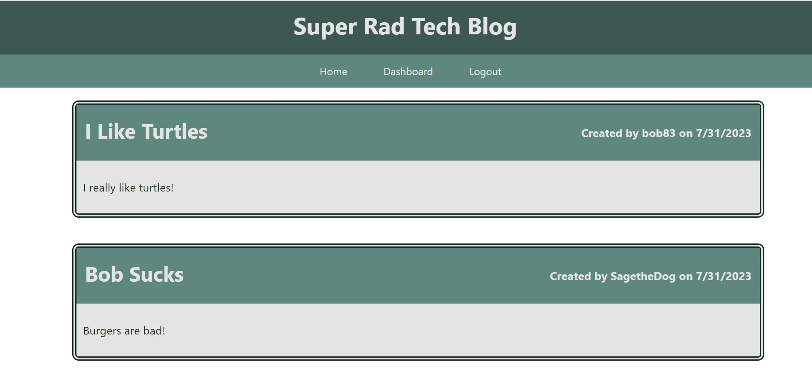

# 14-MVC-Tech-Blog

## Description

  A tech blog website utilizing express-handlebars, Mysql2, Sequelize,  and express-session.
  Website allows users to

  -Create an account or log into an existing one.

  -View all post on the home page.

  -Create, edit, and delete posts.

  -Navigate to individual posts, view comments, and add a new comment to the post.
  
  -Navigate to individual user's profiles to view all posts they have made.

  

  [Walkthrough 1](https://drive.google.com/file/d/1-_SD-umPi-ecZG1LdsST2wdU19uFHIe4/view?usp=drive_link)

  [Walkthrough 2](https://drive.google.com/file/d/1m3xLCwlJ-L2h_xkG8o6vcufcqI7eJ2K-/view?usp=drive_link)

  
## Table of Contents

  1. [Installation](#installation)
  2. [Usage](#usage)
  3. [License](#license)
  4. [Contribution](#contribution)
  5. [Testing](#testing)

## Installation

  npm install

## Usage

  n/a

## License

  None

## Contribution

  n/a

## Testing

  n/a

## Questions
  Email me at [abilivick@gmail.com](mailto:abilivick@gmail.com) or explore more projects at [lailiel](https://www.github.com/lailiel)